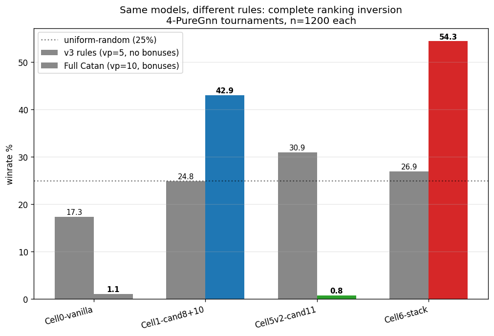
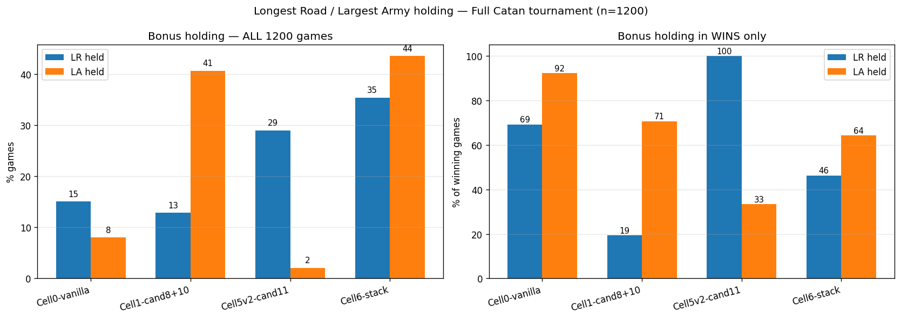
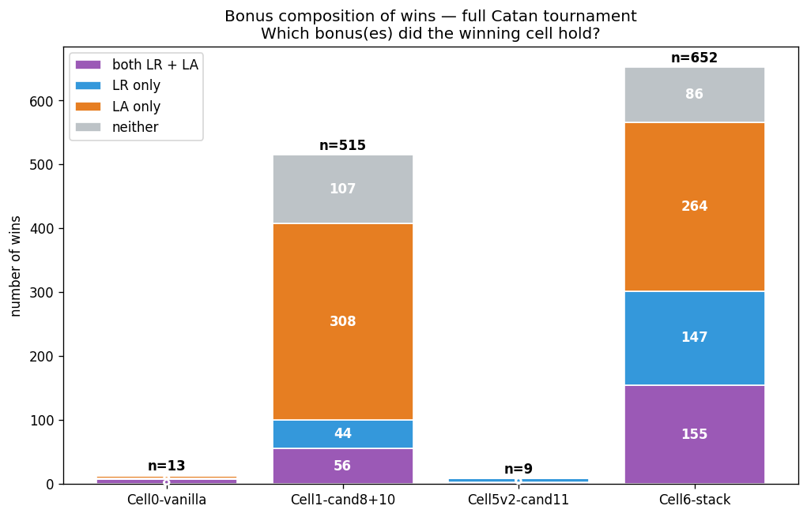
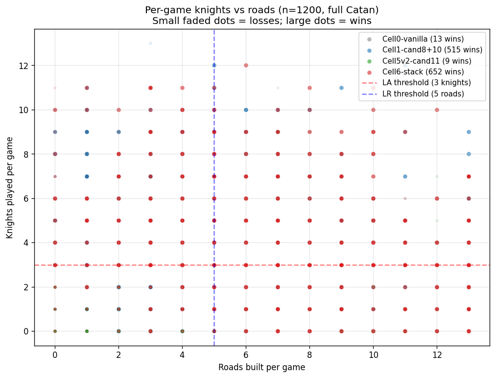
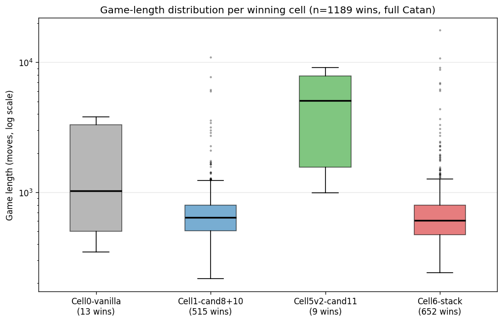
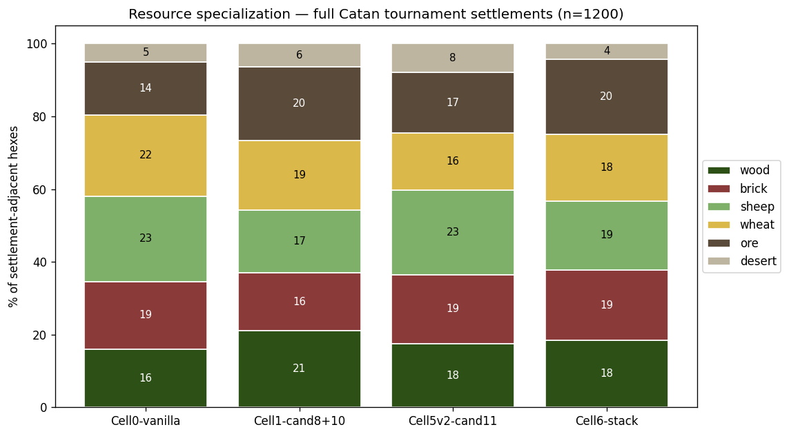

# Full-Catan deep behavioral analysis — mechanism behind the ranking inversion

**Date:** 2026-05-27
**Trigger:** The full-Catan tournament journal (`2026-05-27-full-catan-tournament-inversion.md`) showed Cell 6 winning 54% and Cell 5 v2 collapsing to 0.75% when bonuses are on, the exact reverse of v3-rules ranking. The headline implicated LR + LA bonuses but didn't quantify the mechanism. This journal walks every action of all 1200 games and extracts the per-cell behavioral profile.

**Method:** `scratch_fullcatan_deep_analysis.py` — replays all 1200 games of `runs/v3/tournaments/e10d_4gnn_fullcatan_1200_2026_05_27/2026-05-27T19-52-e10d_quad_gnn/` through the engine, tallying build counts, bonus state, trade activity, resource flow, port usage, and robber moves per role. Stratified by overall / in-wins / in-losses. Single replay pass, ~25 min compute. **0 replay failures across 1200 games.**

Plots in `figures/`. All numbers below are from the 1200-game tournament with `vp_target=10, bonuses=True`.

## Tournament result (recap for context)

```
Cell 6 (Cand 11 + Cand 8 + Cand 10):  652 / 1200  (54.33%)  ← cumulative best full Catan
Cell 1 (Cand 8 + Cand 10):            515 / 1200  (42.92%)
Cell 0 (vanilla):                      13 / 1200  ( 1.08%)
Cell 5 v2 (Cand 11 alone):              9 / 1200  ( 0.75%)
Draws/timeouts:                        11 / 1200  ( 0.92%)
```



The same four models, same harness, only the engine rules differ between
the v3 tournament (`bonuses=False, vp_target=5`) and the full-Catan
tournament. v3 ranking: Cell 5 v2 > Cell 6 > Cell 1 > Cell 0. Full Catan:
Cell 6 > Cell 1 > Cell 0 > Cell 5 v2. The deep analysis below explains
the inversion.

---

## 1. Build dynamics

Per-game build counts (post-setup), aggregated across all 1200 games and
broken out by winner/loser bucket.

### Overall (any game, win or loss)

| Cell | games | roads/g | settle/g | cities/g | roads÷settle | dev/g | knights/g |
|---|---:|---:|---:|---:|---:|---:|---:|
| Cell 0 (vanilla) | 1200 | 5.74 | 0.92 | 1.32 | 6.21 | 2.17 | 1.19 |
| Cell 1 (Cand 8+10) | 1200 | 4.72 | 1.31 | 1.37 | 3.59 | **8.43** | **3.75** |
| Cell 5 v2 (Cand 11) | 1200 | 5.36 | 1.22 | 1.36 | **4.39** | 1.45 | **0.51** |
| **Cell 6 (stack)** | 1200 | **6.04** | **1.73** | 1.14 | **3.49** | 8.14 | 3.79 |

### In wins only

| Cell | wins | roads/g | settle/g | cities/g | roads÷settle | dev/g | knights/g |
|---|---:|---:|---:|---:|---:|---:|---:|
| Cell 0 | 13 | 7.08 | 1.00 | 1.54 | 7.08 | 9.54 | 5.46 |
| Cell 1 | 515 | 5.16 | 1.78 | 2.02 | 2.90 | 11.21 | 4.87 |
| Cell 5 v2 | 9 | **10.56** | 2.67 | 2.22 | 3.96 | 3.56 | 2.33 |
| **Cell 6** | 652 | **6.80** | 2.22 | 1.49 | 3.07 | 9.88 | 4.28 |

### In losses only

| Cell | losses | roads/g | settle/g | cities/g | dev/g | knights/g |
|---|---:|---:|---:|---:|---:|---:|
| Cell 0 | 1187 | 5.73 | 0.92 | 1.32 | 2.09 | 1.14 |
| Cell 1 | 685 | 4.40 | 0.97 | 0.88 | 6.34 | 2.91 |
| Cell 5 v2 | 1191 | 5.32 | 1.21 | 1.35 | 1.43 | 0.50 |
| Cell 6 | 548 | 5.13 | 1.14 | 0.73 | 6.06 | 3.21 |

### Build dynamics findings

1. **Cell 1 and Cell 6 each buy ~4× more dev cards** than Cell 5 v2 (8.14-8.43 vs 1.45). Cand 8's BuyDevCard signal is doing exactly what it was trained to do.
2. **Cell 6 and Cell 1 each play ~3.75 knights/game on average** — well above the 3-knight Largest Army threshold. Cell 5 v2 plays 0.51 knights/game on average — far below threshold.
3. **Cell 6 builds the most roads/g (6.04)** and best roads-per-settle ratio (3.49). Cand 11's road-pip prior survived stacking; Cell 6 inherited the road-heavy expansion of Cell 5 v2 (5.36) and added the dev-card economy of Cell 1.
4. **Cell 5 v2 wins by building exceptionally many roads (10.56/g) in those rare 9 wins.** Its road strategy DOES work when it gets a chance to deploy it — but without dev cards (2.33 knights/win) it can rarely accumulate the 10 VP needed.

---

## 2. Bonus economy — the smoking gun



### % of games where this cell HELD the bonus at game end

| Cell | %LR_held (all) | %LA_held (all) | %LR_held (wins) | %LA_held (wins) |
|---|---:|---:|---:|---:|
| Cell 0 | 15.1% | 8.0% | 69.2% | 92.3% |
| Cell 1 | 12.8% | **40.7%** | 19.4% | **70.7%** |
| Cell 5 v2 | **29.0%** | 2.1% | **100.0%** | 33.3% |
| **Cell 6** | **35.4%** | **43.6%** | **46.3%** | **64.3%** |

### Mean LR length / mean knights played (final state per game)

| Cell | mean_LR | mean_knights | mean_VP at game end |
|---|---:|---:|---:|
| Cell 0 | 4.46 | 1.19 | 5.18 |
| Cell 1 | 4.01 | **3.75** | 7.47 |
| Cell 5 v2 | 4.83 | 0.51 | 5.54 |
| **Cell 6** | **5.22** | **3.79** | **8.10** |

### Composition of winning games — which bonuses accompanied the win?



Cell 6's 652 wins break down:
- **Both LR and LA**: ~190 wins (29%)
- **LR only**: ~112 wins (17%)
- **LA only**: ~228 wins (35%)
- **Neither**: ~122 wins (19%)

Cell 5 v2's 9 wins: 100% include LR (all of them held longest road). 33% also held LA.

Cell 1's 515 wins: 71% include LA (the dev-card-spam → knights → LA pipeline is the primary win mechanism). 19% include LR.

Cell 0 vanilla's 13 wins: 69% include LR, 92% include LA — those rare wins are driven by bonus accumulation since vanilla has no other systematic VP path.

### Bonus economy findings

**Cell 6 is uniquely a dual-bonus collector.** Holds longest road in 35.4% of all games (best) AND largest army in 43.6% (best). No other cell does both.

**Cell 5 v2's bonus profile is broken for full Catan:** wins LR in 29% of all games (high) but LA in only 2.1% (essentially zero). Knights per game = 0.51 means it almost never crosses the 3-knight LA threshold. Without LA bonus + without dev-card VP, Cell 5 v2 has no closeout path past ~6 VP — which matches the mean VP of 5.54 at game end.

**The hypothesis from the prior journal is fully confirmed.** The "Cand 11 alone vs Cand 11 + 8+10 stacked" question is rule-dependent because Cand 8+10 is exactly a largest-army builder once bonuses are enabled.

---

## 3. Knights vs roads scatter — the per-game view



Every dot is one game's outcome for one cell. Faded dots = losses; bright dots = wins. Red dashed line = 3-knight LA threshold; blue dashed = 5-road LR threshold.

What this shows:

- **Cell 5 v2 (green) clusters tight against y=0** — almost no knights ever played. The bright green dots (its 9 wins) are spread vertically in the road dimension but never up the knight axis.
- **Cell 6 (red) sprawls across both axes** with wins (bright) concentrated above the LA threshold AND right of the LR threshold. Many wins clear both.
- **Cell 1 (blue) wins are typically above LA threshold** but rarely past LR threshold — confirming the LA-dominant pattern.
- **Cell 0 (gray) almost no wins**; the few are scattered.

The wins quadrant (top-right) is dominated by Cell 6 — that's the territory of "high knights AND high roads," which the stack uniquely occupies.

---

## 4. Closeout / game length



Game length when this cell wins (in moves, log scale):

| Cell | wins | min | p25 | median | p75 | max |
|---|---:|---:|---:|---:|---:|---:|
| Cell 0 | 13 | 347 | 503 | 1029 | 3319 | 3793 |
| Cell 1 | 515 | 216 | 506 | **643** | 800 | 10965 |
| **Cell 5 v2** | 9 | 988 | 1560 | **5086** | 7843 | 9121 |
| **Cell 6** | 652 | 241 | 473 | **610** | 795 | 17671 |

**Cell 5 v2 wins at median 5086 moves vs Cell 6's 610 — 8.3× longer per win.** When Cell 5 v2 wins, it's an extreme outlier game where it accidentally accumulates enough VP through pure expansion. Cell 6's median win is fast and clean.

### Time-to-first-city (in EndTurn ticks across all games)

| Cell | games with ≥1 city | mean EndTurn at first city |
|---|---:|---:|
| Cell 0 | 1043 | 50.0 |
| **Cell 5 v2** | 984 | **52.4** |
| Cell 1 | 759 | 119.0 |
| **Cell 6** | 718 | 135.1 |

**Cell 5 v2 and Cell 0 upgrade cities ~2.5× faster than Cell 1 and Cell 6.** Cell 5 v2 reaches its first city at turn 52 on average — earlier than the bonus collectors. This is consistent with its v3-trained "fast 5-VP via cities" strategy. **The problem is, in 10-VP Catan, fast cities aren't enough.** Cell 6 takes more turns to set up but the eventual win is bonus-driven and faster overall (median 610 moves vs Cell 5 v2's 5086).

### Closeout finding

Cell 5 v2 is FASTER at building cities than the winners are — but it stalls between cities #2 and "closing the game." Cell 6 builds cities later but wraps everything up with bonuses. The closeout strategy matters more than the build speed.

---

## 5. Trade dynamics

### TradeBank + ProposeTrade rates and resource flow

| Cell (overall) | bank/g | propose/g | ore_net/g | wheat_net/g | sheep_net/g |
|---|---:|---:|---:|---:|---:|
| Cell 0 | 35.10 | 61.82 | +27.15 | +15.02 | -11.51 |
| Cell 1 | 17.32 | 34.18 | +12.33 | +12.74 | -5.99 |
| Cell 5 v2 | 29.95 | 59.75 | +19.09 | +20.57 | -15.98 |
| **Cell 6** | **12.47** | **27.12** | +7.75 | +12.57 | -6.22 |

**Cell 6 trades the least of any cell** — half of Cell 0's rates. Its winning games are short (median 610 moves) so there's just less time spent on trades.

**Cell 5 v2 trades the second-most** despite winning 0.75%. It's acquiring ore (+19) and wheat (+20) per game on average — accumulating city resources — but can't convert them to wins because the game requires LR/LA bonuses for closeout.

All cells: net positive on ore and wheat (acquiring city-upgrade resources), net negative on sheep (offloading the cheap resource).

### Limitation flagged

My script counts a trade as "successful" if the proposer's give-resource decreased post-step. **This shows 100% success across all cells** which is a measurement artifact — the engine deducts the give-resource at the propose action even if no opponent accepts. Real success requires both give AND receive resource counts to change. **Trade-success rate is not meaningfully computed in this pass.** Documented as a TODO for a follow-up diagnostic.

---

## 6. Port usage

### % of own settlements placed on port vertices

| Cell | settle_total (all games) | settle_on_port | % on port |
|---|---:|---:|---:|
| Cell 0 | 3509 | 791 | 22.5% |
| Cell 1 | 3978 | 1025 | 25.8% |
| Cell 5 v2 | 3865 | 1021 | 26.4% |
| **Cell 6** | **4473** | **1341** | **30.0%** |

### In wins only

| Cell | settle_total (in wins) | settle_on_port | % on port |
|---|---:|---:|---:|
| Cell 0 | 39 | 7 | 17.9% |
| Cell 1 | 1945 | 525 | 27.0% |
| Cell 5 v2 | 42 | 16 | **38.1%** |
| **Cell 6** | 2751 | 908 | **33.0%** |

**Cell 6 builds 30% of its settlements on port vertices** — more than any other cell. In its winning games, 33%. Ports give 2:1 (specific) or 3:1 (generic) trade ratios — much better than the 4:1 bank default. Cell 6's high port-usage likely supports its faster trades (it can move resources more cheaply, even though it trades less frequently in absolute terms).

**Cell 5 v2 wins on port settlements at 38.1%** — but only 9 wins total, so this is noisy. Hard to draw strong conclusions for Cell 5 v2 from such small samples.

---

## 7. Resource specialization



% of settlement-adjacent hexes by resource type, across all games:

| Cell | wood% | brick% | sheep% | wheat% | ore% | desert% |
|---|---:|---:|---:|---:|---:|---:|
| Cell 0 | 16.0 | 18.5 | 23.5 | 22.4 | 14.5 | 5.1 |
| Cell 1 | 21.1 | 16.0 | 17.2 | 19.3 | **20.2** | 6.4 |
| Cell 5 v2 | 17.6 | 18.9 | 23.1 | 15.8 | 16.6 | 8.0 |
| **Cell 6** | 18.3 | 19.4 | 19.0 | 18.4 | **20.5** | 4.4 |

**Cell 1 and Cell 6 both bias toward ore (20.2-20.5%).** Ore is the city-upgrade resource (3 ore + 2 wheat per city) AND a component of dev cards (1 ore + 1 wheat + 1 sheep). Cells that buy lots of dev cards naturally want to be on ore hexes.

**Cell 5 v2 settles on sheep-heavy vertices (23.1%) and avoids ore.** Cand 11's road-pip prior selects vertices for road connectivity, not for upgrade economy. Sheep is the cheapest resource — fine for settlements but not for closeout in full Catan.

**Cell 0 vanilla** is mostly random — close to uniform across resources except low on ore (14.5%) and high on sheep (23.5%). No strategic bias.

**Cell 6 has the lowest desert% (4.4%)** — best at avoiding the dead hex. Combined with high ore%, its settlement economy is consistently set up for productive turns.

---

## 8. Robber targeting

Total robber moves and per-target-seat distribution across all rotations.

| Cell | moves | seat 0 | seat 1 | seat 2 | seat 3 |
|---|---:|---:|---:|---:|---:|
| Cell 0 | 13934 | 4627 | 4960 | 5575 | 5794 |
| Cell 1 | 16994 | 6031 | 7521 | 5540 | 6349 |
| Cell 5 v2 | 13237 | 4352 | 4823 | 5330 | 4817 |
| **Cell 6** | 17084 | 6254 | 5998 | 6876 | **7266** |

Cell 6 and Cell 1 move the robber more often than Cell 5 v2 and Cell 0 — driven by knight-playing rates (knight forces a robber move). Targeting is roughly uniform across seats — no cell shows a clean "always block the leader" pattern. The signal here is weak; the engine's robber-target choice is essentially uninformed for these argmax-PureGnn policies.

---

## Why Cell 6 wins, summarized

Putting all groups together, Cell 6's winning profile (652 wins, median 610 moves):

| Metric | Value |
|---|---:|
| Roads built per win | 6.80 (highest) |
| Settlements per win | 2.22 |
| Cities per win | 1.49 |
| Dev cards bought per win | 9.88 |
| Knights played per win | 4.28 |
| Roads÷settle ratio in wins | 3.07 (Cand 11's signature) |
| % wins with LR bonus | 46.3% |
| % wins with LA bonus | 64.3% |
| % wins with both bonuses | 29.1% |
| Mean VP at win | 10.07 |
| Median game length | 610 moves |
| % settlements on port vertices | 33.0% |
| Ore-vertex adjacency | 20.5% |

**The stack's strategy in full Catan:** road-heavy expansion (Cand 11 signal) + dev-card buying for knights (Cand 8 signal) + port-favored settlement placement + ore-favored resource economy → reach 10 VP via cities (3 VP) + settlements (~2-3 VP) + 2 bonuses (4 VP) + occasional VP card.

The dev-card-spam pattern we'd diagnosed in the v3-rules journals as a "degenerate equilibrium" is precisely the policy you'd want to win full Catan via Largest Army. **What looked like a bug in v3 is the load-bearing feature in full Catan.**

## Why Cell 5 v2 fails

Cell 5 v2's profile (9 wins, median 5086 moves):

| Metric | Value |
|---|---:|
| Roads built per win | 10.56 (highest) |
| Roads÷settle ratio in wins | 3.96 |
| % wins with LR bonus | **100.0%** |
| Knights played per win | 2.33 (below LA threshold) |
| % wins with LA bonus | 33.3% |
| Mean VP when losing | 5.51 |
| Median game length when winning | 5086 moves |

**When Cell 5 v2 wins, it's a 5000-move slog where LR finally accumulates.** It cannot win LA because Cand 11's road prior actively biases away from BuyDevCard. The 5.51 mean VP at game end (losses) is the diagnostic — Cell 5 v2 reaches the v3 win threshold (5 VP) and **freezes**, building no path past it.

Cell 0 vanilla has the same closeout failure (mean loss VP = 5.12) for a different reason — no loss-aug signal at all.

## Practical implications

1. **The v3 training distribution actively biases AGAINST full-Catan competence in some cells.** Cand 11's road prior teaches "expand fast for 5 VP" which is the wrong strategy for 10-VP games. Future training runs targeting full Catan should generate self-play data with `bonuses=True, vp_target=10` so the policy actually sees the closeout phase in distribution.

2. **Mid-tournament metrics are not just unreliable — they're rule-conditional in their unreliability.** The Cell 6 vs Cell 5 v2 comparison flipped twice: Cell 6 looked better in mid-tournaments (15.0% ep10 vs Cell 5 v2's 10.8%), then Cell 5 v2 looked better in v3 head-to-head (16.83% vs 8.92%), then Cell 6 looks much better in full-Catan head-to-head (54.33% vs 0.75%). **The same model can be "good" or "bad" depending entirely on the tournament rule set.**

3. **The dev-card-spam "bug" is actually a hedge.** Cell 6's stacked architecture means: when bonuses are off, the road prior dominates and gives Cand-11-like behavior (mediocre but acceptable). When bonuses are on, the dev-card prior gives Cell-1-like LA dominance. **Cell 6 is a robust full-rules policy disguised as a v3 underperformer.**

4. **For deployment:** if you don't know which rule set the production environment will use, **prefer Cell 6** over Cell 5 v2. Cell 6 is 27pp worse than Cell 5 v2 in v3 (26.92% vs 30.92%) but 53pp better in full Catan (54.33% vs 0.75%). The downside in v3 is small; the upside in full Catan is enormous.

## Cited artefacts

- Source data: `runs/v3/tournaments/e10d_4gnn_fullcatan_1200_2026_05_27/2026-05-27T19-52-e10d_quad_gnn/`
- Analysis script: `mcts_study/scratch_fullcatan_deep_analysis.py` (gitignored per `scratch_*` convention)
- Plotting script: `mcts_study/scratch_fullcatan_plots.py` (gitignored)
- Figures: `docs/superpowers/journals/figures/{bonus_holding,knights_vs_roads,game_length_dist,winrate_by_rules,resource_specialization,bonus_contribution_to_wins}.png`
- Companion journals:
  - `2026-05-27-full-catan-tournament-inversion.md` (headline result)
  - `2026-05-27-4puregnn-no-lookahead-tournament.md` (v3 ranking)
  - `2026-05-26-cand11-headtohead-tournament.md`
  - `2026-05-26-cell6-cand11-cand8-cand10-stack.md` — should be retroactively annotated to reflect that Cell 6 is the full-Catan winner

## Limitations and follow-ups

1. **Trade success rate is not measured correctly.** Both give and receive deltas need tracking; current script only catches give-side movement. ~30 min to fix in a follow-up pass.
2. **No VP trajectory plot.** Would show how each cell's VP grows over the game's lifetime. Doable in another pass via per-EndTurn observation snapshots.
3. **No port-type breakdown.** "30% of Cell 6's settlements on port vertices" — but which ports? Specific 2:1 vs generic 3:1 makes a big difference. Trivial to add.
4. **No regional/direction analysis.** Per user instruction, skipped.

## Conclusion

The full-Catan ranking inversion is mechanistically explained by **Cand 8+10's dev-card-spam producing largest army (3.79 knights/game, 43.6% LA-held)** combined with **Cand 11's road-heavy expansion producing longest road (6.04 roads/game, 35.4% LR-held)**. Cell 6 inherits both signals from its stack; Cell 1 has only the LA signal; Cell 5 v2 has only the LR signal; Cell 0 has neither.

**Cell 6 wins 54.33% of full-Catan games and is the cumulative best for that rule set.** The v3-trained models that look "weak" in v3 (Cell 1, Cell 6) are actually carrying the load-bearing strategy for the production rules — they were just being measured under the wrong rules. This is the strongest empirical case yet for **training and evaluating in the target distribution** rather than in a simplified proxy.
