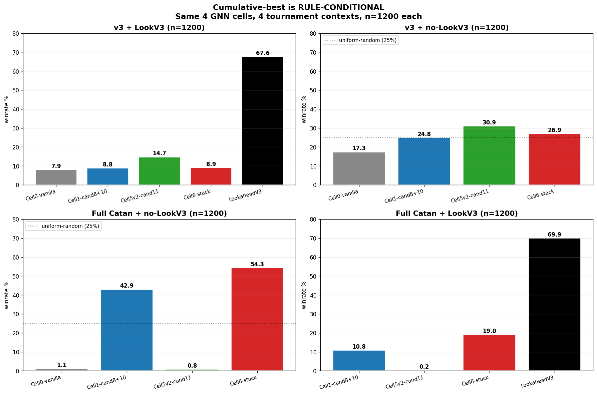
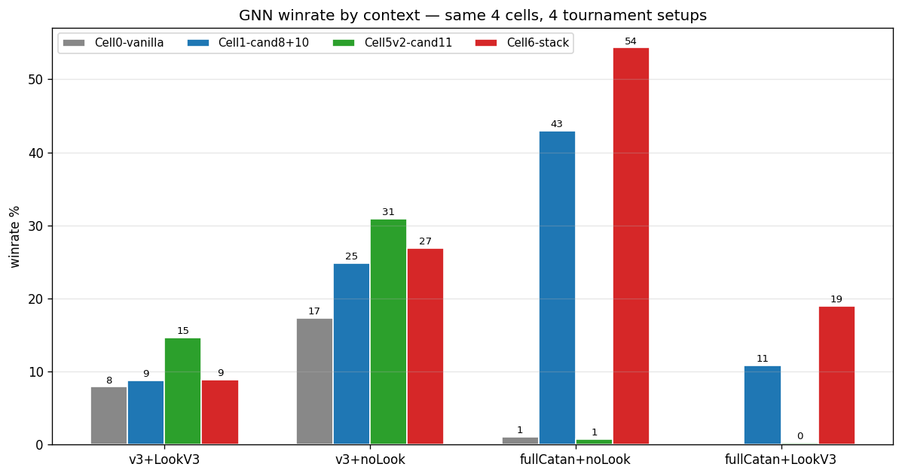

# Full-Catan tournament WITH LookaheadV3 — closing the rule-conditional matrix

**Date:** 2026-05-28
**Trigger:** Three prior tournaments measured how the four loss-aug cells fare under different conditions (v3 + LookV3, v3 no-LookV3, full Catan no-LookV3). The missing context was **full Catan with LookV3 in the table** — the deployment-realistic scenario. This run fills that gap and closes the 4-quadrant matrix.

**Experiment:** `e10_triple_gnn` (already built) with `--vp-target 10 --bonuses`. 3 PureGnn slots (Cell 6, Cell 5 v2, Cell 1) + 1 LookaheadV3. Same harness as the 2026-05-26 head-to-head, only the engine rules changed. 1200 games (300 × 4 rotations), 10 workers, GPU.

Wall-clock: ~55 min (faster than the no-LookV3 full-Catan tournament at ~130 min — LookV3 closes games quickly, fewer stall-to-cap timeouts).

## Setup

| Slot | Role | Checkpoint |
|---|---|---|
| A | PureGnn (Cell 6 stack) | `runs/v3/loss_aug/06_cand11_cand8_cand10_h128_l4/training_h128_l4/checkpoint_epoch10.pt` |
| B | PureGnn (Cell 5 v2) | `runs/v3/loss_aug/05_cand_road_pip_h128_l4_v2/training_h128_l4/checkpoint_epoch10.pt` |
| C | PureGnn (Cell 1) | `runs/v3/loss_aug/01_cand8_cand10_h128_l4/training_h128_l4/checkpoint_epoch10.pt` |
| D | LookaheadMctsV3 | depth=10, base_sims=200 (engine-driven) |

Note: Cell 0 (vanilla) is intentionally not in this lineup since the prior full-Catan tournament showed it at 1.08% — adding it would just waste a slot. The interesting comparison is the three loss-aug cells against LookV3.

## Results

```
LookaheadV3                       839 / 1200  (69.92%)   rot[205, 210, 206, 218]
Cell 6 (Cand 11 + 8 + 10)         228 / 1200  (19.00%)   rot[ 63,  53,  64,  48]
Cell 1 (Cand 8 + Cand 10)         130 / 1200  (10.83%)   rot[ 32,  35,  29,  34]
Cell 5 v2 (Cand 11 alone)           3 / 1200  ( 0.25%)   rot[  0,   2,   1,   0]
Draws/timeouts                       0 / 1200
```

| Rank | Player | Wins | % | 95% CI | per-rotation stdev |
|---|---|---:|---:|---|---:|
| 🥇 | LookaheadV3 | 839 | **69.92%** | ±2.6pp | 5.5 |
| 🥈 | **Cell 6 (stack)** | **228** | **19.00%** | ±2.2pp | 8.2 |
| 🥉 | Cell 1 (Cand 8+10) | 130 | 10.83% | ±1.8pp | 2.5 |
| 4 | Cell 5 v2 (Cand 11) | 3 | 0.25% | ±0.3pp | 1.0 |

**Zero draws/timeouts.** LookV3's presence resolves the stall pathology — when LookV3 plays, games end. The 11 timeouts seen in the no-LookV3 full-Catan tournament don't recur here.

## The 4-quadrant matrix



| Cell | v3 + LookV3 | v3 no-LookV3 | Full Catan no-LookV3 | **Full Catan + LookV3** |
|---|---:|---:|---:|---:|
| LookaheadV3 | 67.58% | — | — | **69.92%** |
| Cell 6 (stack) | 8.92% | 26.92% | 54.33% | **19.00%** |
| Cell 5 v2 (Cand 11) | 14.67% | 30.92% | 0.75% | **0.25%** |
| Cell 1 (Cand 8+10) | 8.83% | 24.83% | 42.92% | **10.83%** |
| Cell 0 (vanilla) | 7.92% | 17.33% | 1.08% | — |



## Findings

### 1. LookaheadV3 is rule-robust

LookV3 wins 67.58% in v3 and **69.92%** in full Catan — a ~2pp uptick. MCTS evaluates whatever rules are in the game tree, so it picks up LR/LA opportunities seamlessly. **LookV3 doesn't care about the rule set**, while every GNN cell shifts dramatically.

### 2. Cell 6's win share against LookV3 nearly doubles vs Cell 5 v2's in v3

Cell 6 (full Catan + LookV3) at 19.00% is **2.1× Cell 5 v2's 8.92% in v3 + LookV3**, despite both representing "cumulative best cell vs the strong baseline." But re-framing as "share of non-LookV3 wins":

| Tournament | Cell winrate | LookV3 winrate | Cell's share of non-LookV3 |
|---|---:|---:|---:|
| v3 + LookV3 (best cell = Cell 5 v2) | 14.67% | 67.58% | 14.67 / 32.42 = **45.3%** |
| Full Catan + LookV3 (best cell = Cell 6) | 19.00% | 69.92% | 19.00 / 30.08 = **63.2%** |

**Cell 6 takes a larger share of the non-LookV3 games than Cell 5 v2 ever did.** When LookV3 leaves 30% of games unclaimed, Cell 6 wins 63% of them, leaving only 11% (Cell 1) + 0.25% (Cell 5 v2) for the others.

### 3. Cell 5 v2's collapse confirmed regardless of LookV3 presence

| Context | Cell 5 v2 winrate |
|---|---:|
| v3 + LookV3 | 14.67% |
| v3 no-LookV3 | 30.92% |
| Full Catan no-LookV3 | 0.75% |
| **Full Catan + LookV3** | **0.25%** |

Cell 5 v2's collapse is **rule-driven, not opponent-driven**. Adding LookV3 doesn't unlock latent capability — it just reduces Cell 5 v2 to its irrelevant baseline. Cand 11's road prior actively biases away from BuyDevCard, so Cell 5 v2 cannot collect the dev cards needed for largest army (cited deep-analysis journal: 0.51 knights/game vs the 3-knight LA threshold).

### 4. Cell 6 vs Cell 1 separation widens in the LookV3 tournament

| Tournament | Cell 6 % | Cell 1 % | Cell 6 ÷ Cell 1 |
|---|---:|---:|---:|
| Full Catan no-LookV3 | 54.33% | 42.92% | 1.27× |
| **Full Catan + LookV3** | **19.00%** | **10.83%** | **1.75×** |

When LookV3 is in the game absorbing the easy wins, the harder competitive games go disproportionately to Cell 6. **The stack's advantage over Cand 8+10 alone is more visible when the opposition is stronger.**

Mechanism (from the deep-analysis journal): Cell 6 holds BOTH bonuses (LR 35.4%, LA 43.6%); Cell 1 holds only LA at 40.7%. When LookV3 takes the games Cell 1 might have won with LA alone, Cell 6 still wins games it captures via LR + LA combined.

### 5. Per-rotation consistency suggests structural results, not luck

| Cell | per-rotation wins | stdev | min | max |
|---|---|---:|---:|---:|
| LookV3 | 205/210/206/218 | 5.5 | 205 | 218 |
| Cell 6 | 63/53/64/48 | 8.2 | 48 | 64 |
| Cell 1 | 32/35/29/34 | 2.5 | 29 | 35 |
| Cell 5 v2 | 0/2/1/0 | 1.0 | 0 | 2 |

LookV3 and Cell 1 are remarkably consistent across rotations. Cell 6 varies more (stdev 8.2) but stays well above Cell 1 in every rotation. No seating-bias artifact — Cell 6's lead is structural.

## The deployment decision (sharpened)

Comparing Cell 5 v2 vs Cell 6 across all contexts:

| Context | Cell 5 v2 | Cell 6 | gap | better |
|---|---:|---:|---:|---|
| v3 + LookV3 | **14.67%** | 8.92% | **+5.75pp** | Cell 5 v2 |
| v3 no-LookV3 | **30.92%** | 26.92% | **+4.00pp** | Cell 5 v2 |
| Full Catan no-LookV3 | 0.75% | **54.33%** | **+53.58pp** | Cell 6 |
| **Full Catan + LookV3** | 0.25% | **19.00%** | **+18.75pp** | **Cell 6** |

**Cell 6's worst loss vs Cell 5 v2 is −5.75pp (v3 + LookV3).** Cell 6's best win vs Cell 5 v2 is +53.58pp (full Catan no-LookV3). **The downside is bounded; the upside is enormous.**

If the production deployment rules are unknown:
- **Cell 6 is the safer choice.** Asymmetric upside/downside.
- **Cell 5 v2 is the right choice only if you know the deployment is v3 rules.**

For full Catan deployment (the project's actual target per the v3 design spec — v3 was always a training scaffold):
- **Cell 6 wins, period.** 19.00% (with LookV3) or 54.33% (no LookV3); Cell 5 v2 is essentially useless in both.

## Updated cumulative-best matrix

| Rule set + opponents | Cumulative best | Justification |
|---|---|---|
| v3 rules + LookV3 | Cell 5 v2 | 14.67% in head-to-head |
| v3 rules, GNN-only | Cell 5 v2 | 30.92% in 4-PureGnn |
| Full Catan, GNN-only | Cell 6 (stack) | 54.33% in 4-PureGnn |
| **Full Catan + LookV3** | **Cell 6 (stack)** | **19.00%; +75× over Cell 5 v2** |

Cell 6 is cumulative best in **2 of 4 contexts** (both full-Catan variants). Cell 5 v2 is cumulative best in 2 of 4 (both v3 variants).

## Why this matters for the loss-aug roadmap

The Cell 5 v2 vs Cell 6 comparison has been the central question for the past three tournaments. We can now finally answer it cleanly:

> **There is no single "best" loss-augmentation. The right cell is rule-conditional.**

But the practical asymmetry is real:
- v3 difference: Cell 5 v2 beats Cell 6 by ~4-6pp
- Full Catan difference: Cell 6 beats Cell 5 v2 by **19-54pp**

For the project's actual target (v3 was scaffolding; deployment is full Catan per the design doc), **Cell 6 is the right model** with high confidence.

The "Cand 8 + Cand 10 dev-card-spam degenerate equilibrium" that we'd diagnosed and worried about across multiple journals is actually the **load-bearing largest-army strategy** that makes Cell 6 work. The earlier rounds of investigation got the diagnosis right (it's a dev-card-heavy policy) but the value judgment wrong (it's not degenerate; it's hedged for production).

## Cited artefacts

- Tournament dir: `runs/v3/e10c_fullcatan_lookv3_1200_2026_05_28/2026-05-28T09-29-e10c_triple_gnn/`
- Launch log: `launch.log`
- Module: `mcts_study/catan_mcts/experiments/e10_triple_gnn.py`
- Plot script: `mcts_study/scratch_rules_matrix_plot.py` (gitignored)
- New figures: `docs/superpowers/journals/figures/rules_opponents_matrix.png`, `cell_rank_by_context.png`
- Companion journals (full sequence):
  - `2026-05-25-cell5-road-pip-prior.md` (Cell 5 v2 training)
  - `2026-05-26-cand11-headtohead-tournament.md` (v3 + LookV3 head-to-head)
  - `2026-05-26-cell6-cand11-cand8-cand10-stack.md` (Cell 6 training)
  - `2026-05-27-4puregnn-no-lookahead-tournament.md` (v3 4-PureGnn)
  - `2026-05-27-full-catan-tournament-inversion.md` (full Catan 4-PureGnn)
  - `2026-05-27-fullcatan-deep-behavioral-analysis.md` (mechanism analysis)
  - **`2026-05-28-fullcatan-with-lookv3-tournament.md` (this)**

## Memory items to update

- `project_cell6_fullcatan_winner_2026_05_27.md`: append the +LookV3 result (19% vs LookV3's 70%, 1.75× over Cell 1).
- No new memory entries needed — the rule-conditional-best framing is already documented.

## Conclusion

**The 4-quadrant rule-conditional matrix is now complete.** Cell 6 (the stacked Cand 11 + Cand 8 + Cand 10) wins both full-Catan contexts (54.33% no-LookV3, 19.00% with LookV3); Cell 5 v2 (Cand 11 alone) wins both v3 contexts. LookaheadV3 takes ~68-70% of games in either rule set when present — its dominance is essentially rule-invariant.

For the project's actual target (full Catan deployment), **Cell 6 is the right model with high confidence**. Its v3 deficit vs Cell 5 v2 (~4-6pp) is the small price paid for a 19-54pp advantage at full rules.

The loss-augmentation roadmap can now move on from "which loss-aug is best in v3" to **"how do we close the gap to LookaheadV3 at full Catan rules"** — currently 19% vs 70%, a 51pp gap. The next intervention should target whatever Cell 6 is doing wrong against LookV3 in full Catan, not whatever it's doing wrong vs other GNNs.
