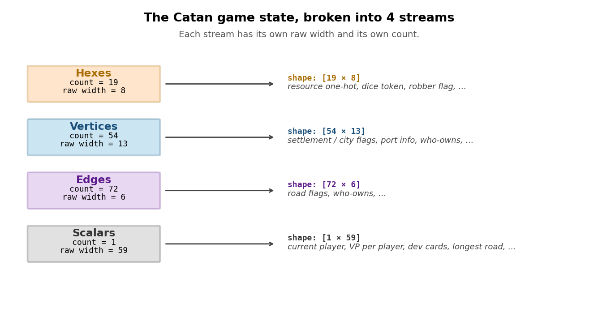
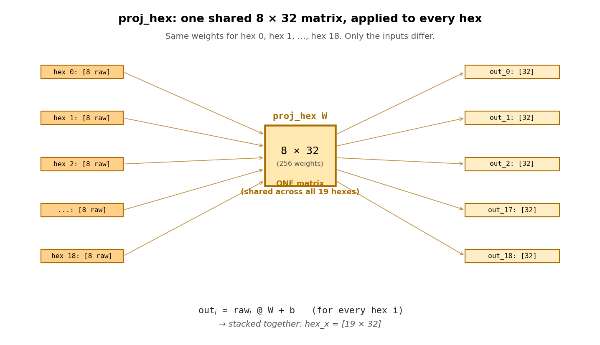
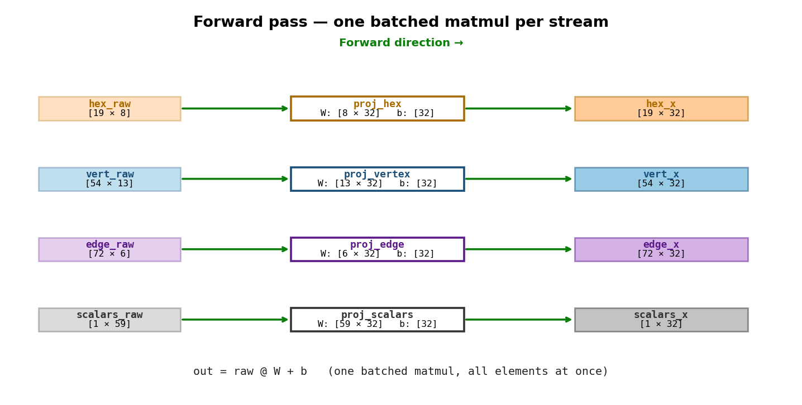
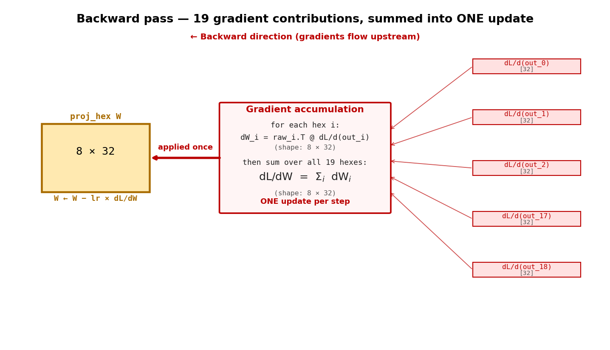

# How to Build a Catan AI Using GNN

> A hands-on textbook for learning Graph Neural Networks by building a Catan game-state evaluator. Each chapter covers one stage of the pipeline. Forward pass first, then backward pass, with visuals throughout.

## Table of Contents

1. **Chapter 1 — Input Projection** (← you are here)
2. *Chapter 2 — The Graph Connectivity (`edge_index`)* (TODO)
3. *Chapter 3 — Message Passing with SAGEConv* (TODO)
4. *Chapter 4 — Heads: Value and Policy* (TODO)
5. *Chapter 5 — Training the Whole Thing End-to-End* (TODO)
6. *Chapter 6 — Plugging the Network into Search (MCTS)* (TODO)

---

# Chapter 1 — Input Projection

**Goal of this chapter.** Take the raw Catan game state and turn it into a uniform set of feature vectors that the rest of the network can consume. By the end, you will understand:

- What the raw game state actually looks like (4 separate streams)
- Why we put each stream through its own little linear layer
- How weight sharing works across all 19 hexes (and why it's the most important trick in this whole architecture)
- What happens during the forward pass (one batched matrix-multiply per stream)
- What happens during the backward pass (gradients sum, weights update once)

We will *not* yet talk about how the hexes/vertices/edges are connected to each other. That is the `edge_index` and it is Chapter 2's job. For now, treat the four streams as independent.

---

## 1.1  The raw state — four streams

A Catan position is messy. The board has 19 hexagonal tiles, 54 corner intersections (where settlements go), 72 edges between intersections (where roads go), and a bag of "global" facts that don't belong to any specific tile or vertex (whose turn it is, victory points per player, who has the longest road, dev card counts, …).

If we tried to flatten all of that into one giant vector, we would lose all structural information. So we keep the four streams *separate* until the model itself decides how to combine them.

| Stream | Count | Raw width per element | What's in it |
|---|---|---|---|
| Hexes | 19 | 8 | resource one-hot, dice token, robber flag, … |
| Vertices | 54 | 13 | settlement / city flags, port info, who-owns, … |
| Edges | 72 | 6 | road flags, who-owns, … |
| Scalars | 1 | 59 | current player, VP per player, dev card counts, longest-road owner, … |



Two things to notice.

First, the **counts are fixed by the geometry of a Catan board**. Every Catan game has 19 hexes, 54 vertices, 72 edges, and one global state. We can hard-code this; the model never has to learn "how many hexes are there."

Second, the **raw widths are different**. A hex needs 8 numbers to describe it; a vertex needs 13; the global state needs 59. This is going to be a problem in a moment, because the rest of the network wants every node to speak the same "language" (the same vector width). Our first job is to fix that.

---

## 1.2  The fix: project everything to width 32

We pick a single number — call it `H` — that will be the **hidden width** of the whole model. For our smallest grid cell, `H = 32`. (Bigger models use 64 or 128.)

For each of the four streams, we attach a tiny neural-network layer called a *linear layer* (or "projection"):

```python
self.proj_hex     = nn.Linear(8, 32)    # one for hexes
self.proj_vertex  = nn.Linear(13, 32)   # one for vertices
self.proj_edge    = nn.Linear(6, 32)    # one for edges
self.proj_scalars = nn.Linear(59, 32)   # one for the global state
```

Each `nn.Linear(in_dim, 32)` is just a learnable matrix `W` of shape `[in_dim, 32]` plus a bias vector `b` of shape `[32]`. Given a raw input vector `x` of size `in_dim`, it computes:

```
out = x @ W + b              # out has size 32
```

That is the entire layer. There is no nonlinearity here — it's literally a matrix multiplication and an add.

> **Why no nonlinearity?** The purpose of this layer is just to *change the width*. The graph layers that come next (Chapter 3) provide all the nonlinearity we need. Stacking a nonlinearity here would not buy us much because the next layer already does it.

After all four projections, every element of every stream is a 32-dim vector:

| Stream | Before | After |
|---|---|---|
| Hexes | `[19 × 8]` | `[19 × 32]` |
| Vertices | `[54 × 13]` | `[54 × 32]` |
| Edges | `[72 × 6]` | `[72 × 32]` |
| Scalars | `[1 × 59]` | `[1 × 32]` |

The downstream network can now treat all four streams uniformly because they all have the same per-element width.

---

## 1.3  Weight sharing — the heart of why this works

Look at `proj_hex` again. It is a single `8 × 32` matrix (256 weights, plus 32 biases — call it ~290 numbers). But we have 19 hexes on the board.

**One matrix is applied to all 19 hexes.**

This is called *weight sharing*. The same `W` runs for hex 0, for hex 1, …, for hex 18. The outputs differ only because the inputs differ.



Why is this such a good idea?

1. **Sample efficiency.** During training, every position contributes 19 separate "votes" on what the matrix should look like. If each hex had its own private matrix, every hex would only learn from its own slot — losing 18/19 of the signal.

2. **Generalization across positions.** A wheat-6 in slot 3 of one game and a wheat-6 in slot 14 of another game are the *same kind of hex*. Weight sharing forces the model to extract features that are useful regardless of slot — features like "high-pip dice tokens matter" or "robber is bad" — instead of memorizing per-slot quirks.

3. **Parameter count stays small.** Without weight sharing we'd have `19 × 256 = 4,864` weights just for hexes. With it, we have 256. The savings only get bigger for vertices (54×) and edges (72×).

The same logic applies to `proj_vertex` (one `13 × 32` matrix shared across all 54 vertices) and `proj_edge` (one `6 × 32` matrix shared across all 72 edges). The scalars projection is technically also "shared," but trivially — there's only one global vector per position, so there's only ever one input.

> **Mental model.** Think of `proj_hex` as a tiny robot whose job is *"given an 8-number description of a hex, produce a 32-number summary that is useful for downstream Catan reasoning."* Training teaches that one robot to do its job well across all 19 positions and all millions of game states it sees.

---

## 1.4  The forward pass

Forward = "compute outputs from inputs." For each stream, we do exactly one linear layer. In code it looks like this:

```python
hex_x     = self.proj_hex(hex_raw)         # [19, 8]  → [19, 32]
vert_x    = self.proj_vertex(vert_raw)     # [54, 13] → [54, 32]
edge_x    = self.proj_edge(edge_raw)       # [72, 6]  → [72, 32]
scalars_x = self.proj_scalars(scalars_raw) # [1, 59]  → [1, 32]
```

Under the hood, PyTorch does each of those as **one batched matrix multiply**. It does *not* loop over the 19 hexes one at a time. The whole batch goes through the GPU as a single operation:

```
hex_x = hex_raw @ W_hex + b_hex
        [19, 8]   [8, 32]   [32]
        ───────────────────
              [19, 32]
```

(The bias `b_hex` is broadcast across all 19 rows.)



After this step, we have a clean uniform tensor for every stream:

- `hex_x: [19, 32]`
- `vert_x: [54, 32]`
- `edge_x: [72, 32]`
- `scalars_x: [1, 32]`

These are exactly what the next stage of the network (the SAGEConv body, Chapter 3) wants to consume.

---

## 1.5  The backward pass

Backward = "given how wrong our output was, figure out how to nudge every weight to be less wrong next time."

For a non-shared layer, this is straightforward: compute one gradient, apply one update. But for `proj_hex`, the *same* matrix `W` was used 19 times during the forward pass. What happens during backward?

The chain rule says: when a parameter is reused in multiple places in the forward pass, **the gradients from all those uses add up**.

Concretely, suppose the loss `L` is some scalar number (like cross-entropy on the policy head). For each hex *i*, the network produces a downstream gradient `dL/d(out_i)` — a 32-dim vector saying *"if `out_i` had been slightly different in this direction, the loss would have been smaller."*

Each hex's contribution to `W`'s gradient is:

```
dW_i = raw_i.T @ dL/d(out_i)        # shape: [8, 32]
```

(That's just the standard backward formula for a linear layer.)

Then PyTorch sums all 19 contributions into a single accumulated gradient:

```
dL/dW = Σ over i = 0..18 of dW_i    # shape: [8, 32]
```

And the optimizer applies one update:

```
W ← W − learning_rate × dL/dW
```



Three things to internalize.

1. **One update per training step, not 19.** Even though 19 hexes contributed gradients, the matrix is updated once. The 19 contributions are *summed* before the update, not applied sequentially.

2. **No ordering.** Hex 0's gradient and hex 18's gradient are added in arbitrary order — addition is commutative, and on a GPU all 19 are computed in parallel anyway. The question "which hex goes first?" has no answer because nothing is sequential.

3. **The update is a consensus.** Each hex pulls the matrix in the direction that would be best *for that hex*. The actual update is the vector sum of all 19 pulls. If 18 hexes want a weight to increase and 1 wants it to decrease, the increase wins (proportionally to gradient magnitudes). Across many training steps and many positions, the matrix converges to settings that are jointly good for all hexes everywhere.

This sum-then-update behaviour is what makes weight sharing actually work mathematically. PyTorch's autograd handles it for free — every time `W` shows up in the backward graph, the new gradient is *added* to `W.grad`, never overwriting it. By the time the optimizer reads `W.grad`, all 19 contributions are already summed in.

---

## 1.6  Why projection layers update last (in time) but first (in position)

`proj_hex` is the *first* layer in the forward pass — it sees the raw input before anything else. That means it is the *last* layer to receive its gradient during backward, because the gradient has to travel back through every downstream layer first (the graph body, the heads, the loss).

This has a practical consequence: in very deep networks, the gradient that arrives at the input projections is often quite small (the chain rule has multiplied through many Jacobians). Weights at the front of the network learn more slowly than weights at the back. Our model is shallow enough (2-4 layers in the body) that this isn't a real problem, but it's why deeper networks need techniques like residual connections, batch norm, or careful initialization.

---

## 1.7  Putting it all together

End of Chapter 1, here is what we have:

- A clean way to convert a messy multi-stream Catan position into four uniform 32-dim tensors.
- Four small projection matrices (`proj_hex`, `proj_vertex`, `proj_edge`, `proj_scalars`) that are trained jointly with the rest of the network.
- A working understanding of weight sharing — why one matrix is reused across all 19 hexes, and how the backward pass handles that correctly by summing gradients.

What we don't yet have:

- Any notion of *which* hex is connected to *which* vertex. The four streams are still independent. The model has no idea that hex 5 borders vertex 12.
- Any nonlinearity. The current pipeline is just four linear maps in parallel. By itself, this can't model anything interesting.

Both of those are fixed in the next two chapters. Chapter 2 introduces the `edge_index` — a fixed table that encodes the geometry of the Catan board. Chapter 3 introduces SAGEConv — the layer that actually mixes features across connected nodes, with nonlinearity, to produce something the value and policy heads can learn from.

---

## Coming up next

- **Chapter 2 — `edge_index`**: how we tell the model that hex H_i borders vertices V_a, V_b, V_c. This is the "graph" part of "graph neural network" and it deserves its own chapter.
